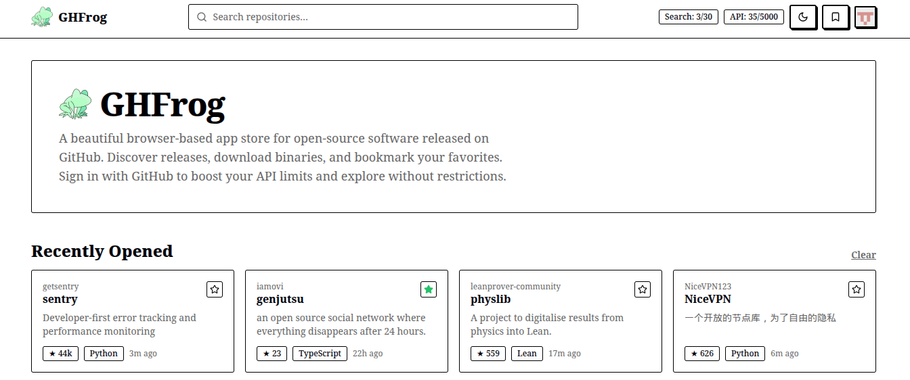

`ghfrog` is a browser-based app store for open-source software released on GitHub. Discover releases, download binaries, and bookmark your favorites. Sign in with GitHub to boost your API limits and explore without restrictions.

**App: https://ghfrog.pages.dev**

## Features

- **App Discovery:** Browse trending, popular, and recently updated GitHub repositories that have binary releases.
- **Advanced Search:** Search for apps by language, platform (Windows, Mac, Linux, Android), or keyword.
- **One-Click Downloads:** Automatically detects your operating system and highlights the correct binary for quick downloading.
- **Favorites:** Bookmark your favorite apps (saved locally) for easy access.
- **GitHub OAuth:** Sign in with your GitHub account via Supabase to securely elevate your GitHub API rate limit from 60 to 5,000 requests per hour.
- **Dark Mode:** Fully supports system dark/light modes.

## License

[MIT](../LICENSE)
